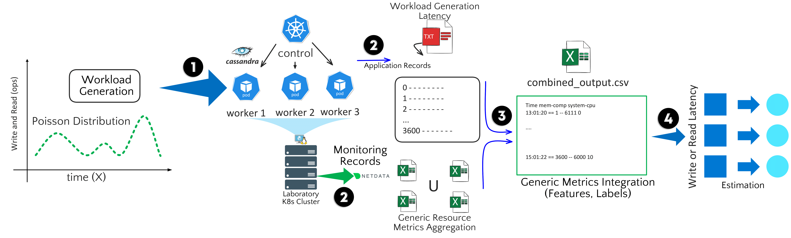

# 🚀 Estimating Application Performance in Container-Based Environments: A Cross-Domain Monitoring Approach

  

## 📌 About the Project

This repository contains the code and software artifacts developed for the paper:

**Title:** _Estimating Application Performance in Container-Based Environments: A Cross-Domain Monitoring Approach_  
**Authors:** Marcus V. Diniz dos Reis, Rodrigo Moreira, Larissa F. Rodrigues Moreira, Flávio de Oliveira Silva  
**Conference:** _Accepted at The 39th International Conference on Advanced Information Networking and Applications (AINA-2025)_  

### 📖 Abstract

Estimating application performance in distributed scenarios is challenging due to numerous variables and influences. Combining Artificial Intelligence (AI) with advanced monitoring methods offers a promising approach for predicting application quality.  

State-of-the-art solutions leverage robust monitoring and AI algorithms, such as Deep Neural Networks (DNNs), to detect temporal relationships and improve estimation accuracy. However, these methods often require significant computational resources and impose overheads due to the fine-grained monitoring requirements.  

This paper proposes an alternative hypothesis: **effective insight into the application's behavior and user perception does not rely solely on highly granular metrics**. Instead, lightweight AI algorithms combined with generic infrastructure metrics—such as computing, networking, storage, and operating system variables—can yield valuable patterns. Our method achieved **lower Mean Absolute Error (MAE) and Mean Squared Error (MSE)** in forecasting **write-and-read operation latencies** in a database cluster, demonstrating its effectiveness and efficiency.

---

## 📂 Repository Structure

* consider changing repo branche.


---

## 🛠️ Setup Instructions

### 1️⃣ Clone the repository

```bash
git clone https://github.com/romoreira/SFI2-Adaptive-Slice-SLA.git
cd SFI2-Adaptive-Slice-SLA
```

### 2️⃣ Install dependencies

```bash
pip install -r requirements.txt
```

### 3️⃣ Run the scripts

Train the model:

```bash
python src/model_training.py
```

Run inference:

```bash
python src/inference.py --input data/test.csv
```

---

## 📊 Methodology

<p align="center">
  
</p>

Our approach combines **lightweight AI algorithms with cross-domain monitoring** to forecast application performance in containerized environments efficiently. The methodology demonstrates that **generic system metrics** can accurately estimate application behavior, reducing monitoring overhead.

---

## 📢 Key Findings

📌 **Reduced Overhead**: Achieves **high accuracy** without the need for highly granular monitoring.  
📌 **AI-Driven Predictions**: Uses **efficient AI models** to estimate application latencies.  
📌 **Scalability**: The approach is adaptable to various container-based environments and database clusters.  

---

## 📄 Citation

If you find this repository useful for your research, please cite our work:

```
@article{your_paper_2025,
  title={Estimating Application Performance in Container-Based Environments: A Cross-Domain Monitoring Approach},
  author={Marcus V. Diniz dos Reis and Rodrigo Moreira and Larissa F. Rodrigues Moreira and Flávio de Oliveira Silva},
  journal={AINA 2025 - The 39th International Conference on Advanced Information Networking and Applications},
  year={2025}
}
```

---

## 📬 Contact

📧 For questions or suggestions, reach out:  
Marcus V. Diniz dos Reis - [LinkedIn](https://www.linkedin.com/in/marcus-vinicius0083/)  

---

🛠️ _Stay updated! Contributions are welcome!_ 🚀
